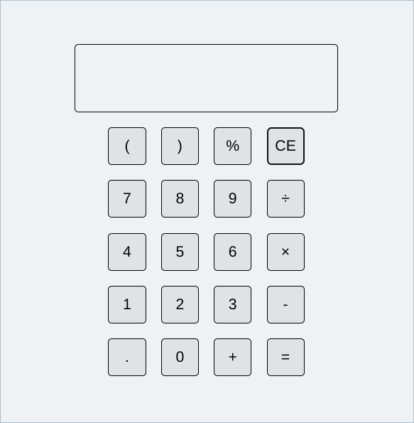

## What we're building

In this tutorial, you'll build a simple calculator with all the basic arithmetic operations.
The picture below depicts what your calculator app should look like once you're done:



Check out the preview [here](https://promethiumjs.github.io/simple-calculator-tutorial/) and view the full code [here](https://github.com/promethiumjs/simple-calculator-tutorial).

## Setup

To get started, [create a new PromethiumJS application](/getting-started/installation).

:::note
This tutorial is going to be using JavaScript so it would be best for you to select the Javascript template when creating the application.
:::

Start the development server by running the npm dev script using your package manager of choice. eg. `npm run dev` if you're using npm. Now open your browser to preview the application if it's not already open.

## Creating a functional component

Proceed to the `App.js` file in the `src` folder of your project directory and replace the contents of the file with the code snippet down below:

```js title="App.js"
import { html } from "lit";

function App() {
  return () => html`<div>Simple Calculator</div>`;
}

export default App;
```

The code above imports the `html` tag function from Lit. It is then used in the functional component named `App` where it's used to facilitate the rendering of a `div` element containing the text "Simple Calculator" into the [DOM](https://developer.mozilla.org/en-US/docs/Web/API/Document_Object_Model/Introduction).

Notice how the functional component returns a function that then returns the result of passing the template string through the `html` tag function. Learn more about how templating in Lit works [here](https://lit.dev/docs/templates/overview/).

## Building the calculator UI

The calculator UI consists of its display and buttons. We can represent those with a `div` element and a few `button` elements:

```js title="App.js" {4-40}
import { html } from "lit";

function App() {
  return () => html`
    <div>
      <div>Screen</div>
      <div>
        <div>
          <button>(</button>
          <button>)</button>
          <button>%</button>
          <button>CE</button>
        </div>
        <div>
          <button>7</button>
          <button>8</button>
          <button>9</button>
          <button>÷</button>
        </div>
        <div>
          <button>4</button>
          <button>5</button>
          <button>6</button>
          <button>×</button>
        </div>
        <div>
          <button>1</button>
          <button>2</button>
          <button>3</button>
          <button>-</button>
        </div>
        <div>
          <button>.</button>
          <button>0</button>
          <button>=</button>
          <button>+</button>
        </div>
      </div>
    </div>
  `;
}

export default App;
```

## Creating reusable components

It's time to add styles and interactivity to our application. Let's begin with our buttons. But before we proceed, take note of the fact that they're all going to be similar in some ways and different in others, both in terms of styles and functionality. We could modify all the buttons differently to look and behave the way we want, but it would be much better to create a reusuble component so go ahead and create a new file called `Button.js` and populate it with the following code snippet:

```js title="Button.js"
import { html } from "lit";

function Button() {
  return () => html`<button>X</button>`;
}

export default Button;
```

Now update `App.js` to use our new `Button` component:

```js title="App.js" {2-3} {10-14}
import { html } from "lit";
import { h } from "promethium-js";
import Button from "./Button";

function App() {
  return () => html`
    <div>
      <div>Screen</div>
      <div>
        <div>${h(Button)} ${h(Button)} ${h(Button)} ${h(Button)}</div>
        <div>${h(Button)} ${h(Button)} ${h(Button)} ${h(Button)}</div>
        <div>${h(Button)} ${h(Button)} ${h(Button)} ${h(Button)}</div>
        <div>${h(Button)} ${h(Button)} ${h(Button)} ${h(Button)}</div>
        <div>${h(Button)} ${h(Button)} ${h(Button)} ${h(Button)}</div>
      </div>
    </div>
  `;
}

export default App;
```

## Passing down props

At this point, every button in our application displays "X" instead of their appropriate symbols, so let's modify our `Button` component to accept a `symbol` prop to display as the symbol of the calculator button:

```js title="Button.js" {4}
import { html } from "lit";

function Button(props) {
  return () => html`<button>${props.symbol}</button>`;
}

export default Button;
```

And then pass our symbols through every `Button` we use in our `App` component

```js title="App.js" {11-12} {15-16} {19-20} {23-24} {27-28}
import { html } from "lit";
import { h } from "promethium-js";
import Button from "./Button";

function App() {
  return () => html`
    <div>
      <div>Screen</div>
      <div>
        <div>
          ${h(Button, { symbol: "(" })} ${h(Button, { symbol: ")" })} ${h(
            Button,
            { symbol: "%" },
          )} ${h(Button, { symbol: "CE" })}
        </div>
        <div>
          ${h(Button, { symbol: "7" })} ${h(Button, { symbol: "8" })} ${h(
            Button,
            { symbol: "9" },
          )} ${h(Button, { symbol: "÷" })}
        </div>
        <div>
          ${h(Button, { symbol: "4" })} ${h(Button, { symbol: "5" })} ${h(
            Button,
            { symbol: "6" },
          )} ${h(Button, { symbol: "×" })}
        </div>
        <div>
          ${h(Button, { symbol: "1" })} ${h(Button, { symbol: "2" })} ${h(
            Button,
            { symbol: "3" },
          )} ${h(Button, { symbol: "-" })}
        </div>
        <div>
          ${h(Button, { symbol: "." })} ${h(Button, { symbol: "0" })} ${h(
            Button,
            { symbol: "+" },
          )} ${h(Button, { symbol: "=" })}
        </div>
      </div>
    </div>
  `;
}

export default App;
```

## Adding styles

There are many ways to style a component, but we'll use the `styleMap` directive from Lit. Let's start by styling the main container `div`, the screen `div`, and the `div` that contains the buttons in the `App` component:

```js title="App.js" {4} {7-26} {29-30}
import { html } from "lit";
import { h } from "promethium-js";
import Button from "./Button";
import { styleMap } from "lit/directives/style-map.js";

function App() {
  const containerStyles = {
    width: "100vw",
    height: "100vh",
    display: "flex",
    justifyContent: "center",
    alignItems: "center",
    flexDirection: "column",
    fontFamily: "sans-serif",
  };

  const screenStyles = {
    width: "350px",
    height: "90px",
    padding: "25px",
    fontSize: "20px",
    border: "1px solid black",
    borderRadius: "5px",
    overflowX: "auto",
    marginBottom: "10px",
  };

  return () => html`
    <div style=${styleMap(containerStyles)}>
      <div style=${styleMap(screenStyles)}>Screens</div>
      <div>
        <div>
          ${h(Button, { symbol: "(" })} ${h(Button, { symbol: ")" })} ${h(
            Button,
            { symbol: "%" },
          )} ${h(Button, { symbol: "CE" })}
        </div>
        <div>
          ${h(Button, { symbol: "7" })} ${h(Button, { symbol: "8" })} ${h(
            Button,
            { symbol: "9" },
          )} ${h(Button, { symbol: "÷" })}
        </div>
        <div>
          ${h(Button, { symbol: "4" })} ${h(Button, { symbol: "5" })} ${h(
            Button,
            { symbol: "6" },
          )} ${h(Button, { symbol: "×" })}
        </div>
        <div>
          ${h(Button, { symbol: "1" })} ${h(Button, { symbol: "2" })} ${h(
            Button,
            { symbol: "3" },
          )} ${h(Button, { symbol: "-" })}
        </div>
        <div>
          ${h(Button, { symbol: "." })} ${h(Button, { symbol: "0" })} ${h(
            Button,
            { symbol: "+" },
          )} ${h(Button, { symbol: "=" })}
        </div>
      </div>
    </div>
  `;
}

export default App;
```

Next, let's style our `Button` component:

```js title="Button.js" {2} {5-13} {16}
import { html } from "lit";
import { styleMap } from "lit/directives/style-map.js";

function Button(props) {
  const buttonStyles = {
    width: "50px",
    height: "50px",
    fontSize: "20px",
    margin: "10px",
    border: "1px solid black",
    borderRadius: "5px",
    cursor: "pointer",
  };

  return () =>
    html`<button style=${styleMap(buttonStyles)}>${props.symbol}</button>`;
}

export default Button;
```

The styles used here won't be explained because this is not a CSS tutorial😅.

## Interactivity and stateful components

At this point, all that is left is to make our calculator respond to inputs, process them and show the resulting outputs to the user. To do this, we'll store the output of the calculator screen as internal state of our `App` component using the `adaptState` [adaptation](/core-concepts/core-adaptations) and display it on the screen:

```js title="App.js" {28} {32}
import { html } from "lit";
import { adaptState, h } from "promethium-js";
import Button from "./Button";
import { styleMap } from "lit/directives/style-map.js";

function App() {
  const containerStyles = {
    width: "100vw",
    height: "100vh",
    display: "flex",
    justifyContent: "center",
    alignItems: "center",
    flexDirection: "column",
    fontFamily: "sans-serif",
  };

  const screenStyles = {
    width: "350px",
    height: "90px",
    padding: "25px",
    fontSize: "20px",
    border: "1px solid black",
    borderRadius: "5px",
    overflowX: "auto",
    marginBottom: "10px",
  };

  const [calculatorOutput, setCalculatorOutput] = adaptState("");

  return () => html`
    <div style=${styleMap(containerStyles)}>
      <div style=${styleMap(screenStyles)}>${calculatorOutput()}</div>
      <div>
        <div>
          ${h(Button, { symbol: "(" })} ${h(Button, { symbol: ")" })} ${h(
            Button,
            { symbol: "%" },
          )} ${h(Button, { symbol: "CE" })}
        </div>
        <div>
          ${h(Button, { symbol: "7" })} ${h(Button, { symbol: "8" })} ${h(
            Button,
            { symbol: "9" },
          )} ${h(Button, { symbol: "÷" })}
        </div>
        <div>
          ${h(Button, { symbol: "4" })} ${h(Button, { symbol: "5" })} ${h(
            Button,
            { symbol: "6" },
          )} ${h(Button, { symbol: "×" })}
        </div>
        <div>
          ${h(Button, { symbol: "1" })} ${h(Button, { symbol: "2" })} ${h(
            Button,
            { symbol: "3" },
          )} ${h(Button, { symbol: "-" })}
        </div>
        <div>
          ${h(Button, { symbol: "." })} ${h(Button, { symbol: "0" })} ${h(
            Button,
            { symbol: "+" },
          )} ${h(Button, { symbol: "=" })}
        </div>
      </div>
    </div>
  `;
}

export default App;
```

In the above code snippet, the `adaptState` adaptation is called with initial value as an empty string. The function then returns an array of two values, where its first value is a function that returns the current value of the created state and its second value is a function that updates the value of the created state.

Before we add functionality to the buttons, let's refactor them to be more concise:

```js title="App.js" {36-40} {43-47} {50-54} {57-61} {64-68}
import { html } from "lit";
import { adaptState, h } from "promethium-js";
import Button from "./Button";
import { styleMap } from "lit/directives/style-map.js";

function App() {
  const containerStyles = {
    width: "100vw",
    height: "100vh",
    display: "flex",
    justifyContent: "center",
    alignItems: "center",
    flexDirection: "column",
    fontFamily: "sans-serif",
  };

  const screenStyles = {
    width: "350px",
    height: "90px",
    padding: "25px",
    fontSize: "20px",
    border: "1px solid black",
    borderRadius: "5px",
    overflowX: "auto",
    marginBottom: "10px",
    whiteSpace: "nowrap",
  };

  const [calculatorOutput, setCalculatorOutput] = adaptState("");

  return () => html`
    <div style=${styleMap(containerStyles)}>
      <div style=${styleMap(screenStyles)}>${calculatorOutput()}</div>
      <div>
        <div>
          ${["(", ")", "%", "CE"].map((symbol) =>
            h(Button, {
              symbol,
            }),
          )}
        </div>
        <div>
          ${["7", "8", "9", "÷"].map((symbol) =>
            h(Button, {
              symbol,
            }),
          )}
        </div>
        <div>
          ${["4", "5", "6", "×"].map((symbol) =>
            h(Button, {
              symbol,
            }),
          )}
        </div>
        <div>
          ${["1", "2", "3", "-"].map((symbol) =>
            h(Button, {
              symbol,
            }),
          )}
        </div>
        <div>
          ${[".", "0", "+", "="].map((symbol) =>
            h(Button, {
              symbol,
            }),
          )}
        </div>
      </div>
    </div>
  `;
}

export default App;
```

Learn more about rendering lists in your templates [here](https://lit.dev/docs/templates/lists/).

Let's pass functions through the various instances of our `Button` component used in our `App` component to enable them to update the calculator output:

```js title="App.js" {39} {47} {55} {63} {71}
import { html } from "lit";
import { adaptState, h } from "promethium-js";
import Button from "./Button";
import { styleMap } from "lit/directives/style-map.js";

function App() {
  const containerStyles = {
    width: "100vw",
    height: "100vh",
    display: "flex",
    justifyContent: "center",
    alignItems: "center",
    flexDirection: "column",
    fontFamily: "sans-serif",
  };

  const screenStyles = {
    width: "350px",
    height: "90px",
    padding: "25px",
    fontSize: "20px",
    border: "1px solid black",
    borderRadius: "5px",
    overflowX: "auto",
    marginBottom: "10px",
    whiteSpace: "nowrap",
  };

  const [calculatorOutput, setCalculatorOutput] = adaptState("");

  return () => html`
    <div style=${styleMap(containerStyles)}>
      <div style=${styleMap(screenStyles)}>${calculatorOutput()}</div>
      <div>
        <div>
          ${["(", ")", "%", "CE"].map((symbol) =>
            h(Button, {
              symbol,
              onClick: () => setCalculatorOutput(calculatorOutput() + symbol),
            }),
          )}
        </div>
        <div>
          ${["7", "8", "9", "÷"].map((symbol) =>
            h(Button, {
              symbol,
              onClick: () => setCalculatorOutput(calculatorOutput() + symbol),
            }),
          )}
        </div>
        <div>
          ${["4", "5", "6", "×"].map((symbol) =>
            h(Button, {
              symbol,
              onClick: () => setCalculatorOutput(calculatorOutput() + symbol),
            }),
          )}
        </div>
        <div>
          ${["1", "2", "3", "-"].map((symbol) =>
            h(Button, {
              symbol,
              onClick: () => setCalculatorOutput(calculatorOutput() + symbol),
            }),
          )}
        </div>
        <div>
          ${[".", "0", "+", "="].map((symbol) =>
            h(Button, {
              symbol,
              onClick: () => setCalculatorOutput(calculatorOutput() + symbol),
            }),
          )}
        </div>
      </div>
    </div>
  `;
}

export default App;
```

Now let's use the prop in our `Button` component as a click event handler:

```js title="Button.js" {16}
import { html } from "lit";
import { styleMap } from "lit/directives/style-map.js";

function Button(props) {
  const buttonStyles = {
    width: "50px",
    height: "50px",
    fontSize: "20px",
    margin: "10px",
    border: "1px solid black",
    borderRadius: "5px",
    cursor: "pointer",
  };

  return () =>
    html`<button style=${styleMap(buttonStyles)} @click=${props.onClick}>
      ${props.symbol}
    </button>`;
}

export default Button;
```

Now let's modify the functions to delete the last output character when the button symbol is "CE" and evaluate and update the current calculator output when the button symbol is "=". Don't worry about the implementations, they're not specific to PromethiumJS:

```js title="App.js" {31-35} {37-48} {59-61} {94-96}
import { html } from "lit";
import { adaptState, h } from "promethium-js";
import Button from "./Button";
import { styleMap } from "lit/directives/style-map.js";

function App() {
  const containerStyles = {
    width: "100vw",
    height: "100vh",
    display: "flex",
    justifyContent: "center",
    alignItems: "center",
    flexDirection: "column",
    fontFamily: "sans-serif",
  };

  const screenStyles = {
    width: "350px",
    height: "90px",
    padding: "25px",
    fontSize: "20px",
    border: "1px solid black",
    borderRadius: "5px",
    overflowX: "auto",
    marginBottom: "10px",
    whiteSpace: "nowrap",
  };

  const [calculatorOutput, setCalculatorOutput] = adaptState("");

  function backspace() {
    setCalculatorOutput(
      calculatorOutput().slice(0, calculatorOutput().length - 1),
    );
  }

  function evaluate() {
    setCalculatorOutput(
      new Function(
        `const result = ${calculatorOutput()
          .replaceAll("%", "/100")
          .replaceAll("÷", "/")
          .replaceAll("×", "*")}; 
         return result.toString();
          `,
      ),
    );
  }

  return () => html`
    <div style=${styleMap(containerStyles)}>
      <div style=${styleMap(screenStyles)}>${calculatorOutput()}</div>
      <div>
        <div>
          ${["(", ")", "%", "CE"].map((symbol) =>
            h(Button, {
              symbol,
              onClick:
                symbol === "CE"
                  ? backspace
                  : () => setCalculatorOutput(calculatorOutput() + symbol),
            }),
          )}
        </div>
        <div>
          ${["7", "8", "9", "÷"].map((symbol) =>
            h(Button, {
              symbol,
              onClick: () => setCalculatorOutput(calculatorOutput() + symbol),
            }),
          )}
        </div>
        <div>
          ${["4", "5", "6", "×"].map((symbol) =>
            h(Button, {
              symbol,
              onClick: () => setCalculatorOutput(calculatorOutput() + symbol),
            }),
          )}
        </div>
        <div>
          ${["1", "2", "3", "-"].map((symbol) =>
            h(Button, {
              symbol,
              onClick: () => setCalculatorOutput(calculatorOutput() + symbol),
            }),
          )}
        </div>
        <div>
          ${[".", "0", "+", "="].map((symbol) =>
            h(Button, {
              symbol,
              onClick:
                symbol === "="
                  ? evaluate
                  : () => setCalculatorOutput(calculatorOutput() + symbol),
            }),
          )}
        </div>
      </div>
    </div>
  `;
}

export default App;
```

## Conclusion

And that's it! Congratulations on creating your first PromethiumJS app🤝. Feel free to refine the application by:

- Improving the UI
- Handling expression evaluation errors
- And so on...
